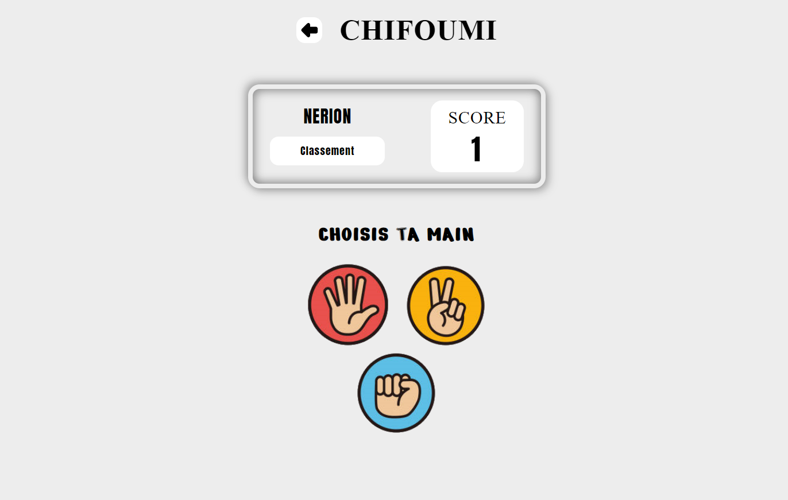

# Chifoumi

Jeu:  Pierre - Feuille - Ciseaux

# Langage solicité

- Sass
- TypeScript
- Next
- Node.js
- Express
- MySQL

# Instruction Execution 

*1-* Installer ```node_module``` dans le dossier back, pour se faire ouvrir un terminal de commande et taper ceci :
- ```cd back```
- ```yarn```


*2-* Créer le fichier ```.env``` dans le dossier back en exécutant le fichier ```createENV``` dans le terminal précédent et taper ceci:
- ```node createENV.js```

*Attention* dans le fichier ```.env``` les valeurs sont mise par défaut est peuvent nécessiter d'être changé:
- **PORT** = Détermine le port pour les requête back-end. Si vous souhaitez le modifier, il faudra aussi modifier dans le dossier:
```front => app => 3_data => links.tsx => Route_Server (ligne: 36 // valeur url)```
- **URL_CLIENT** = Et utilisé pour sécuriser les adresses pouvant envoyer des requêtes au back-end. Next par défaut attribue le port 3000, mais si vous utilisez un autre port modifier ce paramètre.
- **DATABASE** = Le nom attribuer à la base de données.
- **USERDATABASE** = L'identifiant pour vous connecter à votre base de données SQL. Renseigner celui que vous avez défini lors de l'installation de MySQL/PostgreSQL.
- **PASSWORD** = Le mot de passe lié à l'identifiant de votre base SQL. Renseigner ici aussi celui que vous avez défini.


*3-* Générer la base de données SQL avec le fichier ```createDataBase``` en l'exécutant toujours dans le même terminal avec la commande suivante:
- ```node createDataBase.js```


*4-* Démarrer le serveur back-end avec la commande suivante dans le même terminal que précédemment:
- ```yarn start```


*5-* Maintenant partie front installer aussi le ```node_module``` en ouvrant un nouveau terminal est en tapant la commande suivante:
- ```cd front```
- ```yarn```


*6-* Démarrer le front-end avec la commande suivante dans le même terminal que précédemment:
- ```yarn dev```

**WAIT** La compilation est voir afficher ```GET / 200``` dans le terminal.


# Maquette

